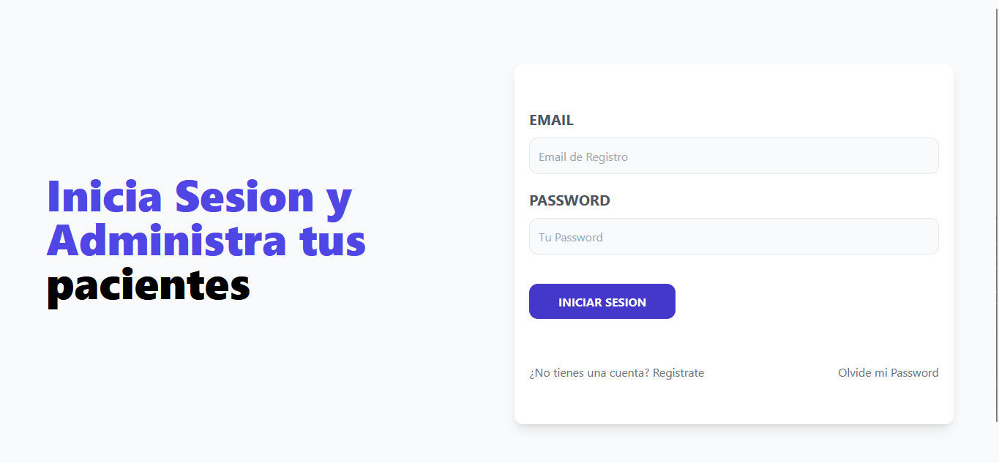
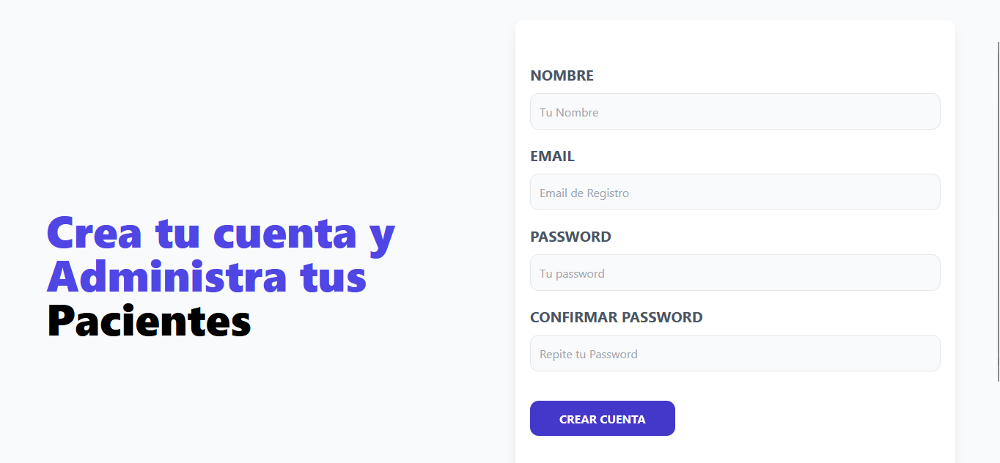
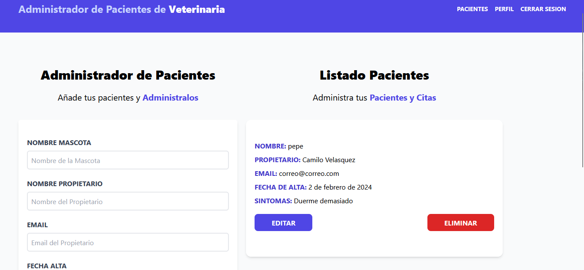

# 🐾 ClinicOS Patient Manager – Frontend

<div align="center">
  
  
  
  
  
  
  
</div>

<br />

**ClinicOS Patient Manager** is a modern, responsive full-stack veterinary clinic management system. The frontend delivers a clean, intuitive interface for veterinary staff to manage patients, schedule appointments, and handle authentication — all communicating securely with a JWT-protected REST API.

---

## 📖 Table of Contents

- [Overview](#-overview)
- [Key Features](#-key-features)
- [Tech Stack](#-tech-stack)
- [Architecture & Patterns](#-architecture--patterns)
- [Getting Started](#-getting-started)
- [Project Structure](#-project-structure)
- [Pages & Routes](#-pages--routes)
- [Screenshots](#-screenshots)
- [Author](#-author)

---

## 🎯 Overview

ClinicOS Frontend is organized into two clear areas:

1. **Authentication Flow (`/login`, `/register`, `/forgot-password`, `/new-password`):** A polished, responsive auth experience with form validation, error feedback, and seamless token management. New users can register and confirm their account via email.
2. **Protected Dashboard (`/admin/…`):** A fully guarded admin panel where authenticated staff can create, view, update, and delete patient records — with real-time feedback and a smooth UX throughout.

## ✨ Key Features

### 🔐 Authentication
- **Registration & Login:** Secure forms with client-side validation and descriptive error messages.
- **Password Recovery:** Full forgot-password flow with email-based token confirmation.
- **JWT Persistence:** Auth tokens are stored and attached to every API request automatically via Axios interceptors.
- **Protected Routes:** Unauthenticated users are redirected away from the dashboard instantly.

### 🐾 Patient Management
- **Full CRUD:** Create, read, update, and delete patient records from a single dashboard view.
- **Inline Editing:** Edit patient data without leaving the current page, keeping the workflow fast.
- **Real-Time Feedback:** Toast-style alerts confirm every action (add, update, delete) instantly.
- **Dynamic Filtering:** Quickly find patients by name or relevant field.

### 🖥 UX & Interface
- **Responsive Design:** Fluid layout optimized for desktops, tablets, and mobile devices.
- **Tailwind CSS Styling:** Consistent, clean utility-first design system throughout.
- **Custom Hooks:** Shared logic for auth and patient data encapsulated in reusable hooks.
- **Context API:** Lightweight global state — no external state library needed.

## 🛠 Tech Stack

Built with a lean, modern React stack:

- **Framework:** [React 18](https://reactjs.org/) bundled with [Vite](https://vitejs.dev/)
- **Routing:** [React Router DOM v6](https://reactrouter.com/) — declarative, nested routes
- **HTTP Client:** [Axios](https://axios-http.com/) — with a pre-configured instance and interceptors
- **Styling:** [Tailwind CSS v3](https://tailwindcss.com/) — utility-first, fully responsive
- **State:** React Context API + Custom Hooks (`useAuth`, `usePatients`)
- **Linting:** ESLint with React-specific plugins

## 🏗 Architecture & Patterns

- **Context + Custom Hooks:** Auth state and patient data live in React Context, consumed through dedicated custom hooks to keep components clean and decoupled.
- **Axios Instance with Interceptors:** A single configured Axios instance in `src/config/` automatically attaches the JWT to every request and handles global error responses.
- **Layout-Based Routing:** Shared layouts (`AuthLayout`, `DashboardLayout`) wrap route groups, centralizing header, footer, and auth guard logic.
- **Component Composition:** UI is broken into small, focused components (forms, cards, alerts) assembled into page-level views.

## 🚀 Getting Started

### Prerequisites

- [Node.js](https://nodejs.org/en/) (v18 or higher)
- Backend API running (see `backend/README.md` for setup)

### Installation

1. **Clone the repository:**
   ```bash
   git clone https://github.com/CamiloVelasquezBotero/MERN_AdministradorDePacientes_FullStackJS.git
   cd MERN_AdministradorDePacientes_FullStackJS/fronted
   ```

2. **Install dependencies:**
   ```bash
   npm install
   ```

3. **Environment Setup:**
   Create a `.env` file in the `fronted` root:
   ```env
   # Base URL of your running backend API
   VITE_BACKEND_URL=http://localhost:5000
   ```

4. **Start the development server:**
   ```bash
   npm run dev
   ```
   Open [http://localhost:5173](http://localhost:5173) in your browser.

## 📁 Project Structure

```text
fronted/
├── src/
│   ├── components/        # Reusable UI components (forms, cards, alerts, modals)
│   ├── config/            # Axios instance & API base configuration
│   ├── context/           # React Context providers (AuthContext, PatientContext)
│   ├── hooks/             # Custom hooks (useAuth, usePatients)
│   ├── layout/            # Shared layouts (AuthLayout, DashboardLayout)
│   ├── paginas/           # Route-level page components (Login, Register, Admin...)
│   ├── App.jsx            # Root component – router & route definitions
│   ├── index.css          # Global base styles
│   └── main.jsx           # App entry point
├── public/                # Static assets (favicon, icons)
├── .env                   # Environment variables (not committed)
├── tailwind.config.js     # Tailwind configuration
├── vite.config.js         # Vite build configuration
└── README.md              # <--- You are reading it!
```

## 🗺 Pages & Routes

| Route | Access | Description |
|-------|--------|-------------|
| `/login` | Public | User login with JWT auth |
| `/register` | Public | New account registration |
| `/forgot-password` | Public | Request a password reset email |
| `/new-password/:token` | Public | Set a new password via email token |
| `/admin` | 🔒 Protected | Dashboard home |
| `/admin/patients` | 🔒 Protected | View, add, edit, and delete patients |
| `/admin/profile` | 🔒 Protected | Manage account profile |

## 📸 Screenshots

<details>
<summary>Click to view screenshots</summary>

- **Login Screen:** 
- **Register Screen:** 
- **Patient Dashboard:** 

</details>

## 👨‍💻 Author

**Camilo Velásquez Botero**
Full Stack Web Developer
- [GitHub](https://github.com/CamiloVelasquezBotero)
- [LinkedIn](https://www.linkedin.com/in/camilodeveloper)

---
*If you liked this project, please consider giving it a ⭐ on GitHub!*
